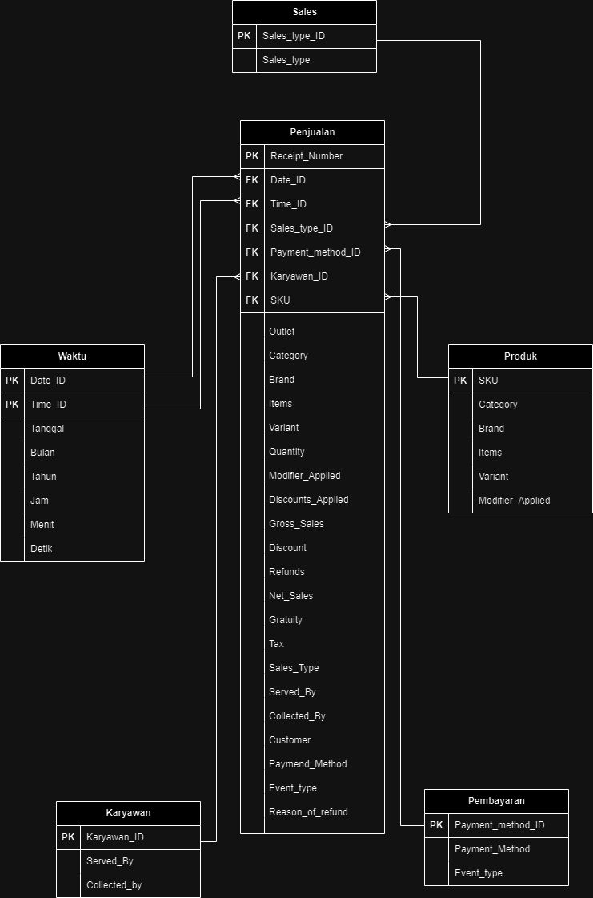

# ☕ Dashboard Cafe Semarang

Analisis Business Intelligence terhadap data transaksi **KM02 Coffee and Working Space** menggunakan pendekatan **Data Warehouse**, **ETL**, **OLAP**, **Power BI**, dan **Market Basket Analysis (Apriori Algorithm)**.

Repository ini merupakan implementasi proses Business Intelligence end-to-end mulai dari pengumpulan data, perancangan data warehouse, transformasi data, visualisasi dashboard, hingga analisis pola pembelian pelanggan.

---

# 📖 Project Overview

Dataset yang digunakan merupakan data transaksi penjualan **KM02 Coffee and Working Space** selama bulan **Juni 2023** yang terdiri dari **2.762 transaksi** dan **25 atribut**. Data ini digunakan untuk mengevaluasi performa penjualan, perilaku pelanggan, metode pembayaran, serta hubungan antar produk yang sering dibeli secara bersamaan. :contentReference[oaicite:0]{index=0}

---

# 🎯 Objectives

Project ini bertujuan untuk:

- Menganalisis performa penjualan cafe.
- Merancang Data Warehouse menggunakan Star Schema.
- Melakukan proses ETL (Extract, Transform, Load).
- Membuat dashboard interaktif menggunakan Microsoft Power BI.
- Menganalisis pola pembelian pelanggan menggunakan Algoritma Apriori.
- Memberikan insight bisnis yang dapat mendukung pengambilan keputusan.

---

# 🛠 Technologies

- Python
- Pandas
- NumPy
- Mlxtend
- Streamlit
- Microsoft Power BI
- Power Query
- Data Warehouse
- OLAP
- Draw.io

---

# 🗄 Data Warehouse Design

Project ini menggunakan **Star Schema** sebagai model data warehouse.

## Fact Table

**Fact Penjualan**

Berisi seluruh transaksi penjualan dengan atribut utama seperti:

- Receipt Number
- Quantity
- Gross Sales
- Discounts
- Refunds
- Net Sales
- Tax
- Gratuity

---

## Dimension Tables

### 📅 Dim_Waktu

- Date_ID
- Time_ID
- Tanggal
- Bulan
- Tahun
- Jam
- Menit
- Detik

### 🍽 Dim_Produk

- SKU
- Category
- Brand
- Items
- Variant
- Modifier Applied

### 👨‍💼 Dim_Karyawan

- Karyawan_ID
- Served_By
- Collected_By

### 💳 Dim_Pembayaran

- Payment_Method_ID
- Payment_Method
- Event_Type

### 🛍 Dim_Sales

- Sales_Type_ID
- Sales_Type

---

## Star Schema

Berikut merupakan rancangan Data Warehouse yang digunakan pada project ini.

  

---

# 🔄 ETL Process

Tahapan ETL meliputi:

### Extract

- Import dataset CSV
- Membaca data transaksi cafe

### Transform

- Menghapus data duplikat
- Membersihkan data
- Menstandarkan nilai Sales Type
- Mengelompokkan metode pembayaran
- Menentukan waktu puncak penjualan
- Membuat atribut waktu

### Load

- Menyimpan hasil transformasi
- Menghubungkan data ke Microsoft Power BI

---

# 📊 Dashboard Features

Dashboard Power BI menyajikan visualisasi berikut:

- Total Sales
- Total Revenue
- Total Transactions
- Best Selling Products
- Sales Trend
- Peak Sales Time
- Sales by Category
- Sales by Payment Method
- Discount Analysis
- Sales Type Distribution

---

# 📈 Business Analysis

Dashboard digunakan untuk menjawab beberapa pertanyaan bisnis seperti:

- Produk apa yang memiliki penjualan tertinggi?
- Kapan waktu puncak penjualan?
- Bagaimana distribusi penjualan berdasarkan Sales Type?
- Bagaimana pengaruh diskon terhadap penjualan?
- Metode pembayaran apa yang paling sering digunakan?

---

# 🛒 Market Basket Analysis

Selain dashboard Power BI, project ini juga mengimplementasikan **Market Basket Analysis** menggunakan **Algoritma Apriori**.

Tahapan analisis meliputi:

- Data Cleaning
- Item Encoding
- Pivot Table
- Frequent Itemsets
- Association Rules

Output yang dihasilkan berupa:

- Support
- Confidence
- Lift
- Frequent Itemsets
- Association Rules

Insight ini dapat digunakan untuk:

- Product Bundling
- Cross Selling
- Menu Recommendation
- Promotional Strategy

---

# 💡 Business Insights

Beberapa insight yang diperoleh dari analisis ini antara lain:

- Produk dengan penjualan tertinggi dapat diidentifikasi untuk mendukung strategi promosi.
- Aktivitas penjualan mencapai puncak pada jam tertentu sehingga dapat menjadi acuan penjadwalan operasional.
- Metode pembayaran yang paling sering digunakan dapat membantu evaluasi layanan pembayaran.
- Pola pembelian pelanggan dapat dimanfaatkan untuk menyusun paket produk dan strategi cross-selling.
- Data warehouse dan dashboard memungkinkan pemantauan performa bisnis secara lebih efektif.

---

# 👨‍💻 Author

**Reza Dwi Puspita**

Universitas Islam Indonesia

---

# ⭐ License

Project ini dibuat untuk tujuan pembelajaran, penelitian, dan portofolio di bidang **Business Intelligence**, **Data Warehouse**, **Data Analytics**, dan **Data Mining**.
